<div align="center">



<br/>

<a href="https://git.io/typing-svg"></a>

<br/>

<a href="https://kagusoftware.com"></a>
<a href="https://github.com/KaguSoftware"></a>


</div>



<div align="center">

</div>


## `> cat mission.txt`

```diff
+ Co-founder of Kagu Software. I own security across every product we ship,
+ end to end: auth, access control, data, infra and incident response.
+ I also build the backends those products run on.

- If a user can see something they shouldn't, it's my bug. Not the UI's.
```


## `> ls ~/kagu/pinned`

<div align="center">
<a href="https://github.com/KaguSoftware/TouchPadel"></a>
<a href="https://github.com/KaguSoftware/TurkCure"></a>
<a href="https://github.com/KaguSoftware/UpperDeck"></a>
<a href="https://github.com/KaguSoftware/KaguOs"></a>
</div>


## `> ./threat-model --show-layers`

<div align="center">

</div>


## `> which arsenal`

<div align="center">


<br/><sub><code>// core</code></sub>
<br/><br/>

<br/><sub><code>// ops &amp; tooling</code></sub>

</div>


## `> tail -f /var/log/activity`

<div align="center">


<br/>


<br/>


</div>


<div align="center">

```
┌──────────────────────────────────────────────────────────┐
│  building something that must not leak?                  │
│  reach Kagu at kagusoftware.com, ask for security.       │
└──────────────────────────────────────────────────────────┘
```



</div>
